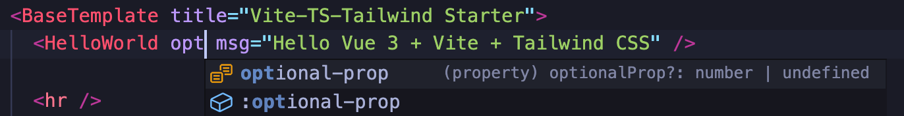

# Vite + Vue 3 + Typescript + Tailwind Starter

Simple, opinionated, **fully typed**, and **production-ready** project template for Vite.



This template is **practical** and **batteries included** but not overly complex or bloated. Also explicit configuration over magic; it should be easy to understand how everything works, strip out anything you don't need, and fast to modify things to your needs.

Includes **plenty of examples** of how to do things but **minimal cruft** to delete to get you going.

A [detailed changelog](./CHANGES.md) is available.

## Features

- Vue 3
- **Fully typed** [Vuex 4](https://next.vuex.vuejs.org/) store
- Routing using [vue-router 4](https://next.router.vuejs.org/)
- TypeScript 4.4
- Tailwind CSS 2.2 w/ JIT compiler + following plugins preinstalled
  - `@tailwindcss/aspect-ratio`
  - `@tailwindcss/line-clamp`
  - `@tailwindcss/typography`
  - `@tailwindcss/forms`
  - `firefox`-variant
- PostCSS 8 w/ `postcss-nesting` plugin
- Eslint
- Prettier
- Alias `@` to `<project_root>/src`
- Manually configured global components in `main.ts`
- Predefined global variables:
  - `VITE_APP_VERSION` is read from `package.json` version at build time
  - `VITE_APP_BUILD_EPOCH` is populated as `new Date().getTime()` at build time
- Using newest `script setup` syntax w/ Ref sugar (see the official [Script Setup documentation](https://v3.vuejs.org/api/sfc-script-setup.html) and [Ref Sugar RFC](https://github.com/vuejs/rfcs/discussions/369) discussion)
- Cypress.io e2e tests (configured similarly to `vue-cli`)
- GitHub workflows
  - Dependabot
  - Automated e2e tests
- GitLab CI
 
## Notes


- In order to take full advance of the new `script setup` sugar and full TypeScript support in Vue SFC templates (like in the screenshot above), you should disable Vetur and use [Volar](https://github.com/johnsoncodehk/volar) instead. (This is totally optional but recommended as it results much better DX!) See [official IDE Support documentation](https://v3.vuejs.org/api/sfc-tooling.html#ide-support).
- If you need more than one parameter in the typed Vuex actions, use `payload` object instead of multiple parameters. For example: 
  ```typescript
  [Action.updateItem](
    { commit }: AugmentedActionContext,
    payload: {
      id: string
      obj: Partial<MyItem>
    }
  ): Promise<void>
  ```

## Project setup and usage

Install dependencies:

```
yarn
```

Run development server:

```
yarn dev
```

Open Cypress test runner:

```
yarn test
```

Run Cypress tests in headless mode:

```
yarn test:ci
```

Build and preview built site locally:

```
yarn preview
```

Build:

```
yarn build
```

## Elsewhere

- Read my continuously updating learnings from Vite / Vue / TypeScript and other Web development topics from my [Today I Learned site](https://til.unessa.net/)
- [Follow @uninen](https://twitter.com/uninen) on Twitter

## Contributing

Contributions are welcome! Please follow the [code of conduct](https://www.contributor-covenant.org/version/2/0/code_of_conduct/) when interacting with others.